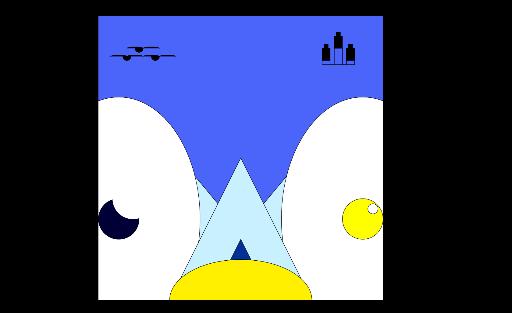

# Instruction-Challenge

Jimmy Le

[View this project online](https://jimmy-le.github.io/CART253/instruction-challenge/index.html)

## Description

>This is a picture of a small land with a a group of tents, between 2 hills, in a world with a moon and sun, birds and floating people.

## Screenshot(s)

> 

## Attribution

> - This project uses [p5.js](https://p5js.org).
> - It uses some starter code from Sabine and Pippin.
> - The barking sound effect is "single dog bark 1" by crazymonke9 from freesound.org: https://freesound.org/people/crazymonke9/sounds/418107/

## License

This bit should include the license you want to apply to your work. For example:

> This project is licensed under a Creative Commons Attribution ([CC BY 4.0](https://creativecommons.org/licenses/by/4.0/deed.en)) license with the exception of libraries and other components with their own licenses.