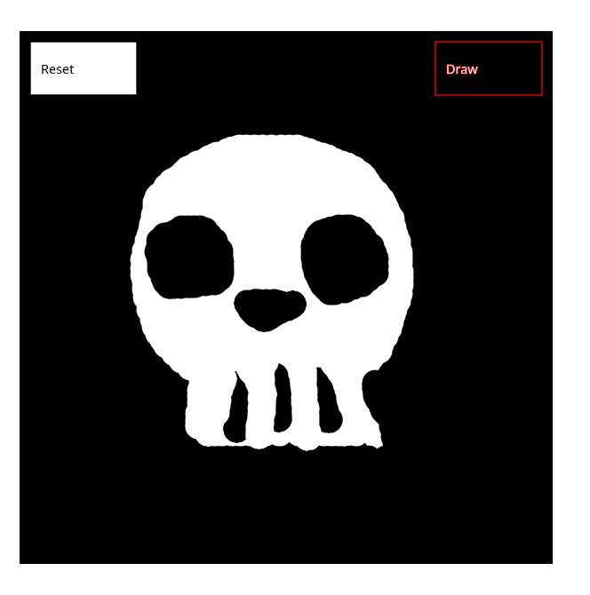

# Canvas

Jimmy Le

[View this project online](https://jimmy-le.github.io/CART253/Assignment3/Prototype3/index.html)

## Description

This prototype offers a canvas for viewers to draw in. They can only draw in black and white.

## Attribution
> - This project uses [p5.js](https://p5js.org).

## License

This bit could include the license you want to apply to your work. For example:

> This project is licensed under a Creative Commons Attribution ([CC BY 4.0](https://creativecommons.org/licenses/by/4.0/deed.en)) license with the exception of libraries and other components with their own licenses.