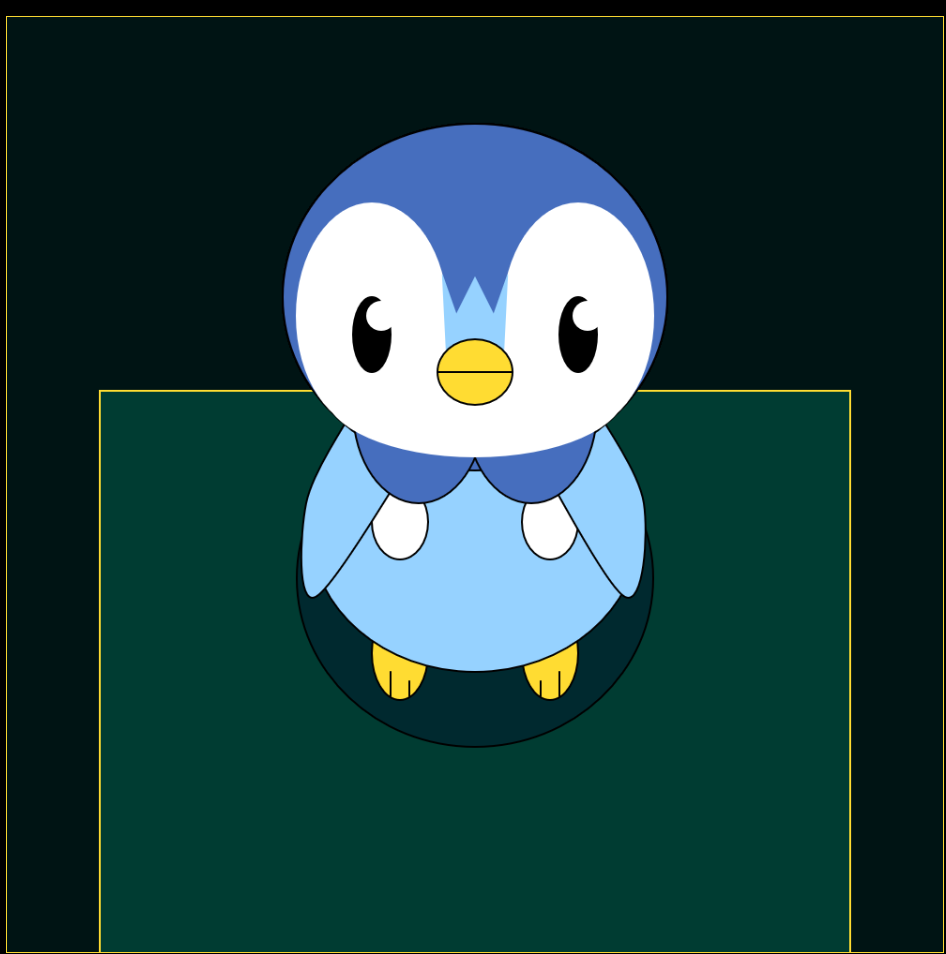
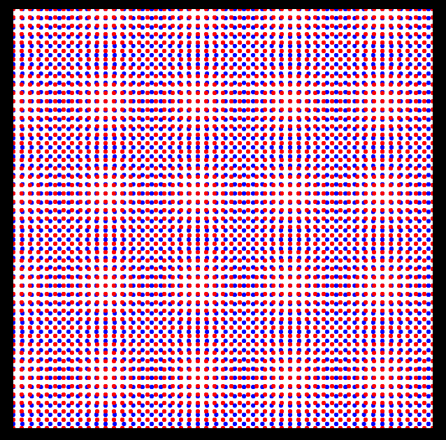
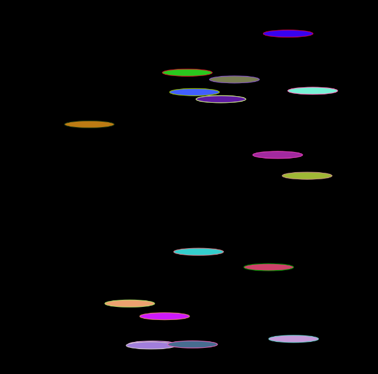
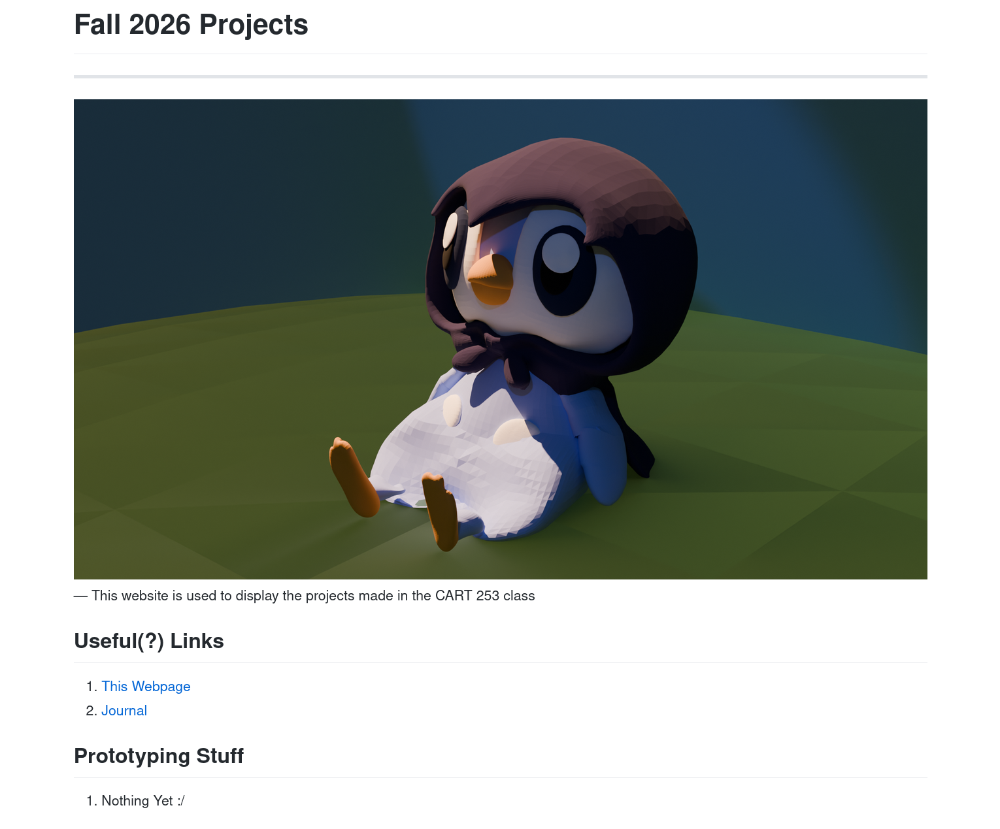

# Reflective Journal
---
## (NEW) 21 September 2026

As of doing the challenge and prototypes, I didn't know anything about P5js so I had to look around the Reference and read through the examples to figure out how to use them. What I learned, is that most of the shape functions are formatted as (x,y) coordinates for each corner of the shape, while others are useing a starting coordinate and then width and height.

For my first prototype, I wanted it to be a more detailed drawing, so I used the different shapes to form a decently accurate piplup. I did try out to use the vertex shapes for more accurate figures, but that was painfully slow to setup, especially when trying to fine-tune the placements. I also wanted to have curvy shapes, so I tried using the bezier shapes, but I gave up and opted to use overlapping circles instead.
Overall, I really liked the results, but man did it take long to get the positioning right

For prototype 2, I wanted to try to procedurally generate the shapes (mainly cause I was tired of calculating coordinates). I was originally thinking about generating the Canada flag through a pointilism artstyle, with the plan being that I have an array of coordinates where it would not draw points once it reaches that point. However, that didn't work for some reason, but it does work with the inverse of generating points on where I **don't** want it to be. So instead, I wanted it to maybe have some columns of different colored points and I ended up with this pattern by shifting the points coordinate index by 1. It makes white circles that aren't actually there which looked cool.

For Prototype 3, I wanted to try making something animated and randomized, so I made it draw shapes of random colors. I did have to wipe the screen because it would keep generating and eating up all the memory of my computer and crashing the browser. So I used the deltaTime provided by P5js to help make the time to delete and spawn drawings consistent. There wasn't really much else with this one. I was really tired at this point.

Also I struggle to commit my changes a lot of the time. I often commit when I am done with a session rather than a section as I ADHD my way through different part rather than focusing on one thing. For this course, I will try to be mindful, but like I will sometimes do things in batches.

---
## 8 September 2026

Imma be real, while I am more experienced with programming in general, I didn't know about GitHub Pages and how easy it was to set up. 
I also didn't know that markdown files could be used as a webpage. It definitely feels a lot easier to write than HTML / CSS, however, the styling could use some work. 
I will probably try to figure out a way to make it more colorful eventually. I will also probably use this to make a portfolio website once I figure out how to style it properly. If not, I can probably use HTML as a base instead.

---
